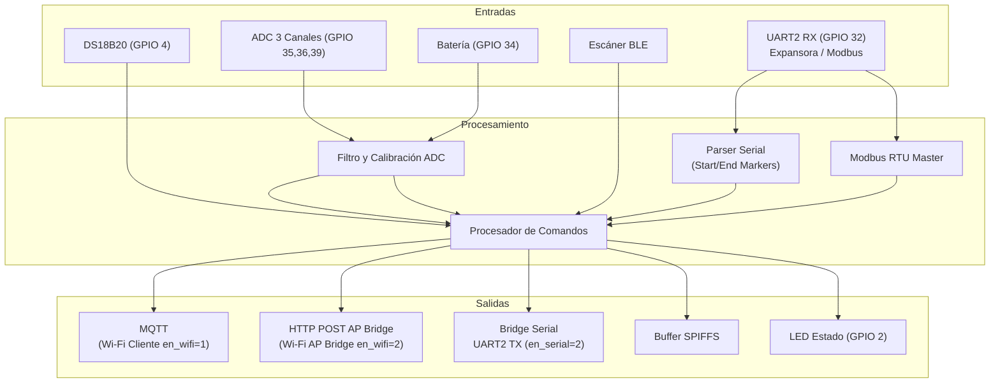

# Documento de Requisitos de Producto (PRD) - Nodo IoT NodeMCU

| Versión | Fecha | Autor | Descripción |
|:---|:---|:---|:---|
| 1.0 | 2026-06-11 | — | Versión inicial del PRD |
| 1.1 | 2026-06-12 | Antigravity | Incorporar especificación de topología estrella (AP Bridge Client por HTTP POST) |

---

## 1. Resumen Ejecutivo

El **Nodo IoT NodeMCU** es un dispositivo de telemetría industrial basado en el microcontrolador ESP32 (placa NodeMCU). Su propósito es capturar datos de múltiples sensores analógicos y digitales, procesarlos localmente con filtrado y calibración, y transmitirlos de forma estructurada. 

Este nodo provee tres vías redundantes e inteligentes de comunicación:
1. **Wi-Fi Cliente estándar:** Conexión directa a routers y brokers MQTT tradicionales en internet.
2. **Wi-Fi AP Bridge Client (Topología Estrella):** Conexión automatizada a una red inalámbrica oculta generada por una placa central LILY-GO para retransmitir datos mediante peticiones locales HTTP POST.
3. **Bridge Serial:** Transmisión transparente de JSONs por su puerto UART2 secundario hacia un gateway físico en zonas sin ninguna cobertura de red local.

---

## 2. Audiencia Objetivo

- Integradores de sistemas IoT industriales.
- Técnicos de telemetría y monitoreo remoto.
- Instaladores de equipos en campo (configuración inicial vía portal web).

---

## 3. Plataforma de Hardware

### 3.1 Microcontrolador

| Componente | Especificación |
|:---|:---|
| **MCU** | ESP32 (Xtensa LX6 de 32 bits, 2 núcleos) |
| **Placa** | NodeMCU (ESP32-DevKitC compatible) |
| **Frecuencia** | 240 MHz |
| **SRAM** | 512 KB |
| **Flash** | 4 MB (con tabla de particiones personalizada) |

### 3.2 Pines y Periféricos

| GPIO | Función | Tipo |
|:---|:---|:---|
| GPIO 0 | Botón de Configuración (AP) | Entrada (Pull-Up) |
| GPIO 2 | LED de Estado | Salida |
| GPIO 4 | Bus 1-Wire (DS18B20) | E/S Digital |
| GPIO 25 | Alimentación Conmutable (Sensores + Expansora) | Salida |
| GPIO 32 | UART2 RX (Secundario / Modbus / Bridge) | Entrada Serial |
| GPIO 33 | UART2 TX (Secundario / Modbus / Bridge) | Salida Serial |
| GPIO 34 | ADC Batería (18650) | Entrada Analógica |
| GPIO 35 | ADC Canal 0 | Entrada Analógica |
| GPIO 36 | ADC Canal 1 | Entrada Analógica |
| GPIO 39 | ADC Canal 2 | Entrada Analógica |

---

## 4. Requisitos Funcionales

### RF-1: Conectividad Wi-Fi y MQTT

| ID | Descripción | Prioridad |
|:---|:---|:---|
| RF-1.1 | El dispositivo debe conectarse a una red Wi-Fi local con credenciales almacenadas en NVS. | Alta |
| RF-1.2 | Debe publicar datos de telemetría en formato JSON a un broker MQTT configurable si está en modo Cliente (`en_wifi=1`). | Alta |
| RF-1.3 | Debe mantener un tópico Keep-Alive con estado general del dispositivo. | Alta |
| RF-1.4 | **Multimodo de WiFi:** El dispositivo debe admitir el comando `DVL+EN_WIFI=<0\|1\|2>` para configurar su comportamiento:<br>- `0`: WiFi deshabilitado (óptimo para Bridge Serial).<br>- `1`: WiFi Cliente estándar (conecta a router local y broker MQTT).<br>- `2`: WiFi AP Bridge Client (conecta a AP oculto LILY-GO). | Alta |
| RF-1.5 | **Cliente AP Bridge:** Al configurarse en modo `2`, el NodeMCU debe conectarse de forma automática y transparente al SSID oculto `LILYGO_BRIDGE_NET` (passphrase `TCSA-Bridge-2026`) y desviar todas sus transmisiones a peticiones HTTP POST (puerto 8080) hacia el endpoint `/retransmit` en la IP `192.168.4.1`, omitiendo los loops de MQTT y NTP directos. | Alta |

### RF-2: Portal Web de Configuración (Modo AP)

| ID | Descripción | Prioridad |
|:---|:---|:---|
| RF-2.1 | Al iniciar sin credenciales Wi-Fi o al presionar el botón GPIO 0 por 5 segundos, debe entrar en modo Access Point. | Alta |
| RF-2.2 | Debe proveer un portal web (puerto 80) para escanear redes e ingresar credenciales. | Alta |
| RF-2.3 | Debe proveer un portal de administración (puerto 8080) para configurar el broker MQTT y ver lecturas en vivo. | Media |

### RF-3: Lectura de Sensor de Temperatura (DS18B20)

| ID | Descripción | Prioridad |
|:---|:---|:---|
| RF-3.1 | Leer temperatura desde sensor DS18B20 mediante bus 1-Wire (GPIO 4). | Alta |
| RF-3.2 | Implementar ciclo de energía controlado (GPIO 25) para reiniciar el bus si se detectan fallos de comunicación. | Alta |
| RF-3.3 | Validar lecturas fuera de rango (-20 a +50 °C) y descartar valores inválidos. | Alta |

### RF-4: Puerto Serial Secundario (UART2)

| ID | Descripción | Prioridad |
|:---|:---|:---|
| RF-4.1 | El puerto UART2 (GPIO 32/33) debe ser configurable en velocidad (1200-115200 baud). | Alta |
| RF-4.2 | **Modo 1 (Lectura Expansora):** Leer tramas ASCII delimitadas por marcadores de inicio/fin configurables y separador configurable, soportando hasta 16 canales (S0..S15). | Alta |
| RF-4.3 | **Modo 2 (Bridge Serial):** Cuando Wi-Fi está caído o deshabilitado, transmitir todos los JSONs de telemetría por UART2 hacia la placa receptora central. | Media |
| RF-4.4 | **Modo Modbus RTU Master:** Interrogar cíclicamente hasta 5 tramas Modbus configuradas (esclavo, función, dirección, cantidad). Excluyente con modo serial. | Alta |

### RF-5: Canales Analógicos (ADC)

| ID | Descripción | Prioridad |
|:---|:---|:---|
| RF-5.1 | Monitorear tensión de batería interna (GPIO 34). | Alta |
| RF-5.2 | Leer 3 canales analógicos independientes (GPIO 35, 36, 39) con calibración lineal configurable (pendiente + offset). | Alta |
| RF-5.3 | Aplicar filtro de promedio móvil configurable para reducir ruido eléctrico. | Media |

### RF-6: Escaneo de Sensores BLE

| ID | Descripción | Prioridad |
|:---|:---|:---|
| RF-6.1 | Escanear balizas BLE compatibles (Moko) en segundo plano y reportar datos de acelerómetro, temperatura, humedad, iBeacon, etc. | Alta |
| RF-6.2 | Publicar cada detección inmediatamente por MQTT, HTTP POST local (AP Bridge) o por bridge serial si corresponde. | Alta |

### RF-7: Comandos Remotos y Locales

| ID | Descripción | Prioridad |
|:---|:---|:---|
| RF-7.1 | Procesar comandos de configuración recibidos por MQTT (tópico `COMANDOS`) y por puerto serial primario (USB). | Alta |
| RF-7.2 | Publicar respuestas a comandos en el tópico `RESPUESTA`. | Alta |
| RF-7.3 | Soportar comandos de habilitación/deshabilitación de módulos, configuración de parser serial, calibración ADC, parámetros Modbus, y actualización FOTA. | Alta |

### RF-8: Actualización de Firmware OTA

| ID | Descripción | Prioridad |
|:---|:---|:---|
| RF-8.1 | Actualizar firmware de forma remota mediante URL enviada al tópico `FOTA`. | Alta |
| RF-8.2 | La URL de FOTA debe persistirse en NVS para futuras referencias. | Media |

---

## 5. Requisitos No Funcionales

| ID | Descripción | Prioridad |
|:---|:---|:---|
| RNF-1 | **Watchdog:** Temporizador por hardware configurado a 120 segundos para reinicio automático ante bloqueos. | Alta |
| RNF-2 | **Persistencia:** Toda configuración debe almacenarse en memoria NVS (Preferences) y sobrevivir a reinicios. | Alta |
| RNF-3 | **Buferización:** Si la red está caída o deshabilitada, los mensajes deben almacenarse en SPIFFS (búfer circular de 1440 paquetes) y reenviarse automáticamente (vía MQTT o HTTP POST) cuando la conexión se restablezca. | Alta |
| RNF-4 | **Exclusión mutua:** Los módulos Modbus y Serial son excluyentes entre sí. El BLE al habilitarse desactiva Sensor y Modbus, pero preserva el modo bridge serial. | Alta |
| RNF-5 | **Versionado:** El firmware debe incluir un número de versión visible en los JSONs de telemetría (actual: `V06.01.01`). | Media |

---

## 6. Arquitectura del Firmware

### 6.1 Diagrama de Bloques



### 6.2 Flujo de Datos

1. Los módulos de entrada (DS18B20, ADC, BLE, UART2) capturan datos crudos.
2. El procesador de comandos aplica filtros, calibración y formato.
3. En cada ciclo de publicación (intervalo configurable), los JSONs se construyen y se envían:
   - Por **MQTT** si `en_wifi == 1` y hay conexión establecida.
   - Por **HTTP POST local** si `en_wifi == 2` hacia el endpoint `/retransmit` en `http://192.168.4.1:8080`.
   - Por **bridge serial (UART2)** si `en_serial == 2` y Wi-Fi está caído.
   - Al **buffer SPIFFS** si no hay ningún medio de conexión activo. Al restablecerse la red, los paquetes en flash se retransmiten en orden por la vía configurada (MQTT o HTTP).

---

## 7. Protocolo y Tópicos

### 7.1 Tópicos MQTT (Modo Cliente en_wifi=1)

| Dirección | Tópico | Propósito |
|:---|:---|:---|
| Publicación | `DVL/NODEMCU/<ident>` | Keep-Alive / Estado general |
| Publicación | `DVL/NODEMCU/<ident>/DS18B20` | Reporte de temperatura |
| Publicación | `DVL/NODEMCU/<ident>/SERIAL` | Datos del puerto serial secundario (S0..S15) |
| Publicación | `DVL/NODEMCU/<ident>/MODBUS` | Respuestas Modbus |
| Publicación | `DVL/NODEMCU/<ident>/ADC` | Reporte de canales ADC |
| Publicación | `DVL/NODEMCU/<ident>/BLE/<MAC>/...` | Datos de sensores BLE detectados |
| Publicación | `DVL/NODEMCU/<ident>/RESPUESTA` | Respuesta a comandos |
| Suscripción | `DVL/NODEMCU/<ident>/COMANDOS` | Recepción de comandos remotos |
| Suscripción | `DVL/NODEMCU/<ident>/FOTA` | URL de actualización de firmware |

### 7.2 Formato JSON (Ejemplo Telemetría con Topic Incorporado)

Cada payload generado incluye de manera interna la propiedad `"topic"` para permitir al AP Bridge de la LILY-GO enrutar el dato correctamente sin inspección profunda:

```json
{
  "topic": "DVL/NODEMCU/OBU_123/DS18B20",
  "ident": "OBU_123",
  "temperatura": "23.50",
  "date": "2026-06-11 12:00:00",
  "Tension_bateria": 4.12,
  "Tension_principal": 12.03,
  "Version": "V06.01.01",
  "index": 42
}
```

---

## 8. Comandos de Configuración

| Comando | Descripción |
|:---|:---|
| `DVL+EN_SERIAL=<0\|1\|2>` | 0=deshabilitado, 1=lectura expansora, 2=bridge serial |
| `DVL+EN_WIFI=<0\|1\|2>` | 0=deshabilitado, 1=cliente Wi-Fi estándar, 2=AP Bridge Client |
| `DVL+EN_SENSOR=<1\|0>` | Habilitar/deshabilitar sensor DS18B20 |
| `DVL+EN_MODBUS=<1\|0>` | Habilitar/deshabilitar Modbus (excluye serial) |
| `DVL+EN_BLE=<1\|0>` | Habilitar/deshabilitar escáner BLE |
| `DVL+EN_ADC=<1\|0>` | Habilitar reporte ADC independiente |
| `DVL+SBAUD=<baud>` | Configurar baud rate del UART2 (1200 a 115200) |
| `DVL+SFINI=<txt>` | Marcador de inicio de trama serial |
| `DVL+SFFIN=<txt>` | Marcador de fin de trama serial |
| `DVL+SPARSE=<char>` | Separador de campos serial |
| `DVL+STIME=<seg>` | Intervalo de publicación |
| `DVL+RESET` | Reiniciar el dispositivo |
| `DVL+EXP_RESET` | Reiniciar la placa expansora |
| `DVL+FOTA=<url>` | Iniciar actualización OTA |
| `EXP+<cmd>` | Enviar comando directo a la expansora |
| `DVL+QEN_SERIAL`, `DVL+QEN_WIFI`, etc. | Consultar estado de módulos |

---

## 9. Topología Estrella y AP Bridge (en_wifi=2)

La topología en estrella permite un despliegue donde múltiples nodos **NodeMCU** se asocian localmente a una única unidad central **LILY-GO** retransmisora.

### 9.1 Parámetros de Enlace
- **SSID del AP Bridge (Oculto):** `LILYGO_BRIDGE_NET`
- **Contraseña:** `TCSA-Bridge-2026`
- **Dirección IP del AP:** `192.168.4.1`
- **Puerto de Escucha:** `8080`
- **Endpoint de Retransmisión:** `/retransmit` (HTTP POST)

### 9.2 Lógica de Enrutamiento Local
Cuando `en_wifi == 2`:
1. El NodeMCU realiza un escaneo activo para conectarse a la red inalámbrica oculta.
2. Tras la asociación exitosa, no abre socket TCP MQTT ni inicia NTP.
3. Al cumplirse el intervalo de telemetría o capturarse tramas locales, se genera el JSON correspondiente (con el campo `"topic"` incorporado) y se despacha a `http://192.168.4.1:8080/retransmit` mediante una petición HTTP POST.
4. La LILY-GO recibe el paquete y se encarga de subirlo al Broker MQTT centralizado usando su módem celular GPRS.
