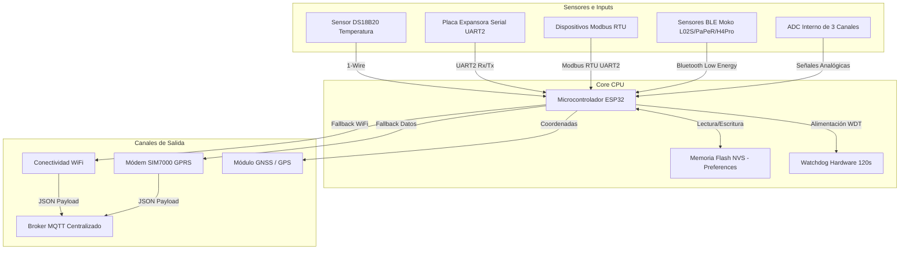

# Documento de Requisitos de Producto (PRD) - LILY-GO Telemetry Device

Este documento detalla los requisitos, arquitectura, componentes y especificaciones del firmware para el dispositivo de telemetría y monitoreo **LILY-GO** (basado en el microcontrolador ESP32 y el módem celular SIM7000).

## 1. Introducción y Objetivos
El objetivo principal del dispositivo es recopilar datos de múltiples fuentes de sensores industriales y ambientales, procesarlos localmente y transmitirlos de manera confiable a un broker centralizado MQTT a través de una arquitectura de red dual inteligente (WiFi y GPRS celular).

El dispositivo está diseñado para operar en entornos remotos o móviles donde la conectividad puede ser inestable, ofreciendo mecanismos avanzados de almacenamiento persistente local, geolocalización y tolerancia a fallos.

## 2. Arquitectura de Bloques del Sistema

El siguiente diagrama ilustra el flujo de datos entre los distintos módulos de hardware controlados por el firmware:



## 3. Requisitos de Hardware y Conectividad

### 3.1 Procesador y Almacenamiento
*   **Microcontrolador:** ESP32 (Soporte Dual Core, temporizador por hardware, bajo consumo).
*   **Watchdog por Hardware:** Watchdog Timer (WDT) configurado a **120 segundos** para reinicio en caso de cuelgues de red o del procesador.
*   **Persistencia (NVS):** Uso de la biblioteca `Preferences` para el almacenamiento en memoria Flash de la configuración persistente (SSID, contraseña, IP del Broker, APN, ID del equipo, calibración del ADC y habilitaciones de módulos).

### 3.2 Modos de Conectividad Dual (Smart Switching)
El firmware gestiona dos interfaces de red con tolerancia a fallas de forma automática:
1.  **Red Local (WiFi):** Interfaz preferida para comunicación de bajo costo. Las credenciales se configuran de forma dinámica en flash.
2.  **Red Móvil (GPRS):** Utilizada como respaldo si no hay redes WiFi disponibles. Implementada usando el controlador `TinyGsm` sobre el módem celular SIM7000.
3.  **Monitoreo de Enlace:** En caso de que se pierda la conexión MQTT por más de **5 minutos** (MQTT_TIMEOUT), el sistema fuerza un ciclo de reconexión profunda o reinicio de los periféricos asociados.

## 4. Módulos y Funcionalidades del Firmware

El dispositivo cuenta con un diseño de firmware modular habilitable bajo demanda mediante comandos de configuración:

### 4.1 Sensor Local 1-Wire (DS18B20)
*   Monitoreo directo de temperatura ambiente o de fluidos.
*   *Exclusión:* Se lee de manera periódica cada 5 segundos si está habilitado mediante `en_sensor=1`.

### 4.2 Puerto Serial Secundario y Placa Expansora
*   UART2 dedicada (Pines RX=GPIO32, TX=GPIO33) a una tasa por defecto de 4800 baudios.
*   Permite enviar tramas crudas hacia la expansora y recolectar las respuestas estructuradas en variables indexadas del sistema (`S0` a `S15`).
*   Se incluye un comando de reinicio físico de la expansora (`DVL+EXP_RESET`) mediante el pin `SENSOR_POWER_PIN`.

### 4.3 Red de Sensores Bluetooth (BLE Moko)
*   Escaneo continuo de balizas BLE usando el controlador `NimBLE` de alta eficiencia.
*   Decodificación nativa de tramas propietarias del fabricante **Moko** (modelos de sensores `L02S`, `PaPeR`, `H4Pro`).
*   Extracción dinámica de: nivel de batería de los tags, temperatura, humedad relativa, estado de movimiento, aceleración en 3 ejes (X, Y, Z) e información de proximidad (UUID/Major/Minor).

### 4.4 Canal de Telemetría Modbus RTU
*   Implementación de comandos Modbus Master sobre el puerto serial secundario.
*   Soporta hasta **5 tramas de consulta** concurrentes configurables por el usuario (especificando ID de esclavo, código de función Modbus [0x03, 0x04, etc.], dirección de registro y cantidad de registros).
*   *Exclusión Mutua:* La habilitación de Modbus (`en_modbus=1`) apaga de forma segura el módulo Serial Secundario ordinario para evitar conflictos en la UART2 compartida.

### 4.5 Módulo de Lectura Analógica (ADC)
*   Monitoreo de hasta **3 canales analógicos** independientes (ADC0, ADC1, ADC2).
*   **Calibración Dinámica:** Factores de conversión lineales e individuales (pendiente $m$ y offset $p$) mediante la fórmula:
    
    `Valor Calibrado = (Lectura Cruda * m) + p`
*   **Filtros de Descarte:** Umbrales mínimos configurables. Si la lectura es inferior a un valor umbral, el firmware la sustituye por un valor estático por defecto (útil para eliminar ruido en cero).
*   **Alisado (Promedio Móvil):** Muestreo acumulado (por defecto de 50 mediciones) antes de publicar un dato estabilizado.

## 5. Protocolo de Telemetría (MQTT JSON Payloads)

Todos los reportes periódicos enviados al Broker MQTT (tópico base: `DVL/LILY-GO/<IDENTIFICADOR>`) se estructuran en formato JSON. Dependiendo de los módulos activos, el firmware transmite diferentes payloads:

### 5.1 Payload Estándar / Serial Secundario
```json
{
  "topic": "DVL/LILY-GO/OBU_123",
  "ident": "OBU_123",
  "S0": "12.5",
  "S1": "45.0",
  ...
  "S15": "0.0",
  "date": "2026-06-04 16:04:00",
  "latitud": "-34.6037",
  "longitud": "-58.3816",
  "Tension_bateria": 4.15,
  "Tension_principal": 12.2,
  "Version": "V04.01.02",
  "index": 482
}
```

### 5.2 Payload Modbus RTU
```json
{
  "topic": "DVL/LILY-GO/OBU_123",
  "ident": "OBU_123",
  "INDEX1": "0103020A4C",
  "INDEX2": "010304001F002A",
  "date": "2026-06-04 16:04:00",
  "latitud": "-34.6037",
  "longitud": "-58.3816",
  "Tension_bateria": 4.12,
  "Tension_principal": 12.0,
  "Version": "V04.01.02",
  "index": 483
}
```

### 5.3 Payload de Diagnóstico (Keep-Alive)
Emitido con información técnica del módem y estado de la red celular:
```json
{
  "topic": "DVL/LILY-GO/OBU_123",
  "status": "keep-alive",
  "date": "2026-06-04 16:04:00",
  "latitud": "-34.6037",
  "longitud": "-58.3816",
  "Version": "V04.01.02",
  "reboot_count": 12,
  "conn_type": "GPRS",
  "conn_detail": "SIM7000 LTE-M",
  "IMEI": "864273040000000",
  "IMSI": "722310100000000",
  "ICCID": "8954012200000000000",
  "RSRQ": "-11.0",
  "RSRP": "-95.0",
  "RSSI": "-78.0"
}
```

## 6. Configuración Local (Modo AP y Web Server)

Para la puesta en marcha inicial del dispositivo o en caso de fallos de red en campo:
1.  **Activación Física:** Manteniendo presionado el botón conectado a **GPIO0 durante 5 segundos**, el microcontrolador guarda el indicador `forceAP` en Flash y se reinicia de manera segura en Modo Punto de Acceso (AP).
2.  **Red Local Generada:** Levanta un SSID visible localmente (por ejemplo, `Flash-PaPeR` o `Invitados`) y monta un Web Server privado de configuración.
3.  **Consola de Administración Web:** Ofrece endpoints HTTP interactivos para:
    *   Escanear y seleccionar redes WiFi locales.
    *   Guardar la clave del WiFi y las credenciales MQTT (IP Broker y Puerto).
    *   Actualizar parámetros de telemetría sin necesidad de recompilar el firmware.

## 7. Interfaz de Comandos de Control (CLI / MQTT)

El dispositivo responde a comandos enviados de forma directa por el puerto Serial Principal (UART0) o de forma remota a través del tópico MQTT de entrada `DVL/LILY-GO/<IDENTIFICADOR>/COMANDOS`. Las respuestas se publican en el tópico `/RESPUESTA` o por terminal.

La lista detallada de los comandos operativos, ejemplos de uso y retornos esperados se encuentra completamente documentada en el archivo de referencia técnica: [main/COMANDOS.md](file:///c:/Users/slerotich/Documents/GitHub/LILY-GO/main/COMANDOS.md).
