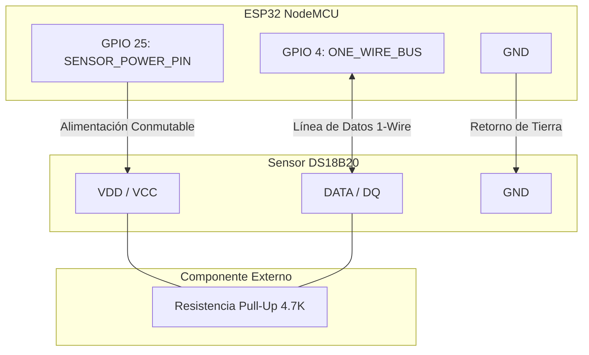
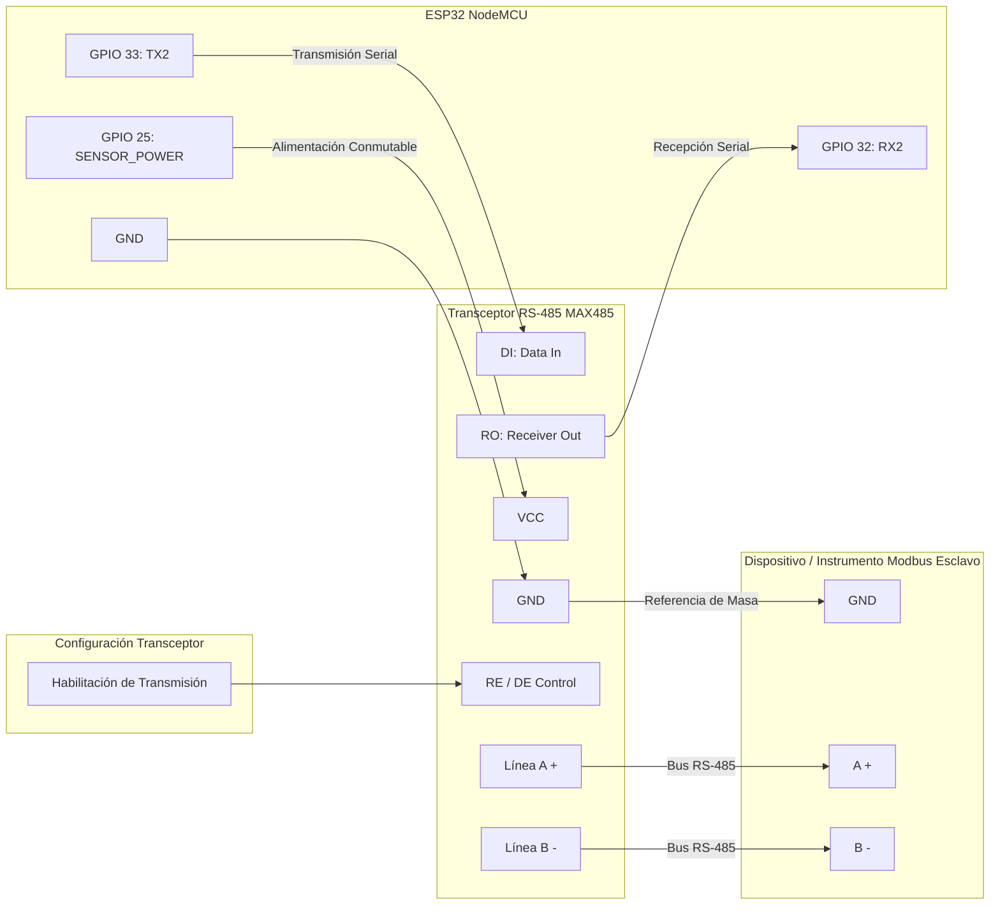
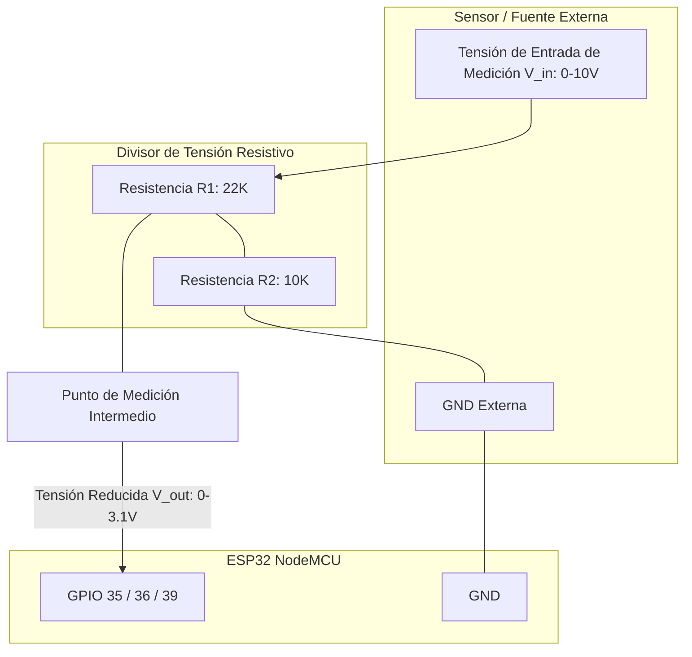
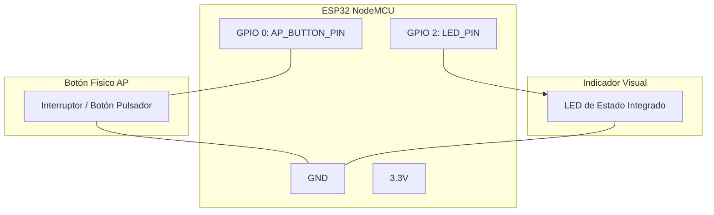

# Documentación de Alcance, Funcionalidades y Conexiones del Firmware NodeMCU

Este documento detalla el alcance del firmware, el desglose de las funcionalidades implementadas en el microcontrolador ESP32 (configurado para placa NodeMCU) y los diagramas de conexiones eléctricas correspondientes a cada interfaz de hardware utilizada.

---

## 1. Alcance del Proyecto

El proyecto consiste en un nodo IoT industrial y de telemetría basado en el chip **ESP32 (NodeMCU)**. Su propósito es capturar información de múltiples fuentes analógicas y digitales, procesar y filtrar localmente las mediciones, y reportarlas de manera estructurada a través del protocolo **MQTT** sobre una red de conectividad **Wi-Fi**.

El sistema es dinámicamente configurable mediante comandos remotos (vía tópicos MQTT dedicados) y locales (vía puerto serial primario). Cuenta además con un portal web integrado (Modo Access Point) para la configuración inicial en campo.

---

## 2. Funcionalidades del Firmware

El firmware dispone de las siguientes funcionalidades y módulos independientes:

### A. Cliente MQTT y Conectividad Wi-Fi
* **Conectividad:** Gestión de conexión a redes Wi-Fi locales con persistencia de credenciales en memoria no volátil (NVS).
* **Protocolo MQTT:** Publicación periódica del estado del dispositivo (Keep Alive) y reportes de telemetría dedicados en formato JSON a través del broker configurado.
* **Tópicos MQTT:**
  * **Publicación:** `DVL/NODEMCU/<ident>` (Reporte general / Keep Alive), `DVL/NODEMCU/<ident>/SERIAL`, `DVL/NODEMCU/<ident>/MODBUS`, `DVL/NODEMCU/<ident>/BLE`, `DVL/NODEMCU/<ident>/ADC`, `DVL/NODEMCU/<ident>/RESPUESTA` (para respuestas a comandos).
  * **Suscripción (Comandos):** `DVL/NODEMCU/<ident>/COMANDOS` (ejecución remota de comandos) y `DVL/NODEMCU/<ident>/FOTA` (actualizaciones OTA).

### B. Modo AP de Configuración (Web Server)
* **Activación:** Se activa al iniciar el dispositivo si no hay credenciales guardadas, o bien si se mantiene presionado el **Botón AP (GPIO 0)** durante el arranque.
* **Portal de Configuración (Puerto 80):** Levanta una red Wi-Fi propia (`DVL AP`) y un servidor web para escanear redes circundantes e ingresar la contraseña de la red seleccionada.
* **Portal de Administración (Puerto 8080):** Servidor web de administración privada para configurar la IP y puerto del broker MQTT, además de mostrar lecturas en tiempo real de los sensores conectados.

### C. Lectura de Sensor de Temperatura DS18B20 (Dallas 1-Wire)
* Lectura del sensor de temperatura digital DS18B20 a través del protocolo **1-Wire** en el **GPIO 4**.
* Control de energía inteligente: El sensor (y la placa expansora) se alimentan a través del pin **GPIO 25** (`SENSOR_POWER_PIN`), permitiendo realizar un reinicio físico (ciclo de energía) del bus de sensores si se detectan fallos de comunicación.

### D. Interfaz Modbus RTU Master o Serial Secundario
* **Puerto UART2:** Utilizado en los pines **GPIO 32 (RX)** y **GPIO 33 (TX)** configurado a **4800 bps**.
* **Modo Modbus RTU:** Permite interrogar de manera cíclica hasta 5 tramas configuradas mediante registros Modbus (esclavos, funciones, direcciones y cantidad de datos).
* **Modo Telemetría Serial ASCII:** Si Modbus está desactivado, el puerto UART2 lee cadenas de caracteres ASCII delimitadas por marcadores de inicio (`DVL+SFINI`), fin (`DVL+SFFIN`) y separador de datos (`DVL+SPARSE`), soportando hasta 16 canales de telemetría.

### E. Entradas Analógicas (ADC) y Monitoreo de Tensión
* Monitoreo de tensión de batería interna en **GPIO 34**.
* Tres canales de lectura analógica independientes:
  * **ADC 0 (GPIO 35)**
  * **ADC 1 (GPIO 36)**
  * **ADC 2 (GPIO 39)**
* **Procesamiento de Señal:** Cada canal dispone de calibración lineal individual mediante coeficientes configurables de escala ($m$) y offset ($p$) a través de la fórmula: 
  $$\text{Valor} = (m \times \text{Lectura Raw}) + p$$
* **Filtro y Alisado:** Implementa un promedio móvil digital de tamaño configurable (alisado) para estabilidad contra ruido eléctrico.

### F. Escaneo de Sensores BLE
* Escaneo en segundo plano de balizas de proximidad y sensores Bluetooth Low Energy (BLE) compatibles (como los sensores Moko). Reporta automáticamente lecturas de acelerómetro, temperatura y humedad.

### G. Mecanismos de Seguridad y Resiliencia
* **Watchdog Timer (WDT):** Temporizador por hardware configurado a **120 segundos** para reiniciar automáticamente el procesador en caso de bloqueos de software.
* **Memoria No Volátil (Preferences):** Guarda la configuración de red, broker MQTT, tópicos, factores de calibración analógica y estado de módulos habilitados de forma segura ante cortes de energía.

---

## 3. Asignación de Pines (GPIO Map)

A continuación se resume la distribución de pines utilizada en el firmware para la placa NodeMCU ESP32:

| GPIO | Función de Hardware | Tipo | Descripción |
| :--- | :--- | :--- | :--- |
| **GPIO 0** | Botón de Configuración | Entrada | Pulso a GND para forzar el Modo Access Point en inicio |
| **GPIO 2** | LED de Estado | Salida | Indicación visual de conexión y transmisión de datos |
| **GPIO 4** | Bus Dallas 1-Wire | E/S Digital | Línea de datos para sensor DS18B20 |
| **GPIO 25**| Control de Alimentación | Salida | Energiza el sensor de temperatura y placa expansora (ON/OFF) |
| **GPIO 32**| UART2 RX | Entrada Serial| Recepción de datos Modbus RTU / Telemetría Serial externa |
| **GPIO 33**| UART2 TX | Salida Serial| Transmisión de datos Modbus RTU |
| **GPIO 34**| ADC Batería | Entrada Anal.| Monitoreo de nivel de batería (18650) |
| **GPIO 35**| ADC Canal 0 | Entrada Anal.| Entrada de sensor analógico 0 |
| **GPIO 36**| ADC Canal 1 | Entrada Anal.| Entrada de sensor analógico 1 |
| **GPIO 39**| ADC Canal 2 | Entrada Anal.| Entrada de sensor analógico 2 |

---

## 4. Diagramas de Conexión

A continuación se detallan los diagramas eléctricos y conexiones requeridos para implementar cada funcionalidad.

### A. Alimentación y Control de Energía del Sensor (GPIO 25 y GPIO 4)

El sensor digital de temperatura DS18B20 se conecta al bus 1-Wire y se alimenta de forma conmutable a través del pin GPIO 25. Esto permite reiniciar el sensor por software ante errores de comunicación.

* **Nota:** Es indispensable conectar una resistencia de pull-up de **4.7 kΩ** entre el pin de alimentación (`VDD`) y la línea de datos (`DQ`) para asegurar el correcto funcionamiento del protocolo 1-Wire.

---

### B. Conexión de Comunicación Serial y Bus Modbus RTU (GPIO 32, 33 y 25)

Para establecer comunicaciones Modbus RTU (RS-485) o comunicación serial con la placa expansora, se utiliza el puerto UART2. En caso de requerir bus físico RS-485, se interpone un transceptor RS-485 (ej. MAX485).

---

### C. Conexiones del Conversor Analógico-Digital (ADC 35, 36, 39 y 34)

El ESP32 dispone de un ADC interno de aproximaciones sucesivas (SAR). Para la lectura de tensiones superiores a los límites del chip (3.3V máximo, recomendado 0-3.1V con atenuación de 11dB), se utiliza un circuito divisor resistivo.

* **Fórmula del Divisor de Tensión:**
  $$V_{out} = V_{in} \times \left( \frac{R_2}{R_1 + R_2} \right)$$
  Para $R_1 = 22\text{ k}\Omega$ y $R_2 = 10\text{ k}\Omega$, una entrada de $10\text{ V}$ se reduce a $3.125\text{ V}$, ideal para el rango del ADC configurado con **11dB de atenuación**.

---

### D. Botón de AP (Configuración) y LED de Estado

El botón de restauración y el LED de estado proporcionan la interfaz de interacción física mínima del nodo NodeMCU.

* **Funcionamiento del Botón:** El pin GPIO 0 posee pull-up interno. Al presionar el pulsador se cierra el circuito a GND (nivel lógico `LOW`), lo cual es detectado al arrancar para ingresar al Modo AP.
* **Patrón de destellos del LED:**
  * **1 parpadeo de apagado cada 5 segundos:** Dispositivo conectado a Wi-Fi y reportando a MQTT de manera exitosa.
  * **3 destellos cortos cada 2 segundos:** Conectado a la red Wi-Fi local, pero el broker MQTT no se encuentra disponible.
  * **LED Apagado:** Sin conexión Wi-Fi configurada o activa.
