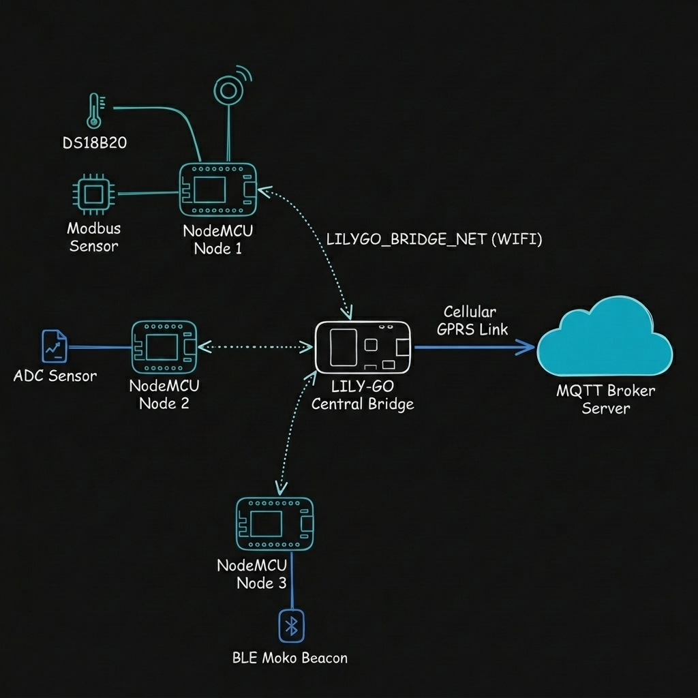

# Esquema de la Topología Estrella y Conectividad

Este documento describe la topología de red en estrella diseñada para la comunicación entre las estaciones **NodeMCU**, el nodo central **LILY-GO** (AP Bridge) y el **Broker MQTT**.

---

## Representación Visual de la Arquitectura

A continuación se presenta el diagrama de arquitectura y flujo de datos:

---

## Descripción del Flujo de Datos

1. **Nodos Locales (NodeMCU):**
   * **NodeMCU 1:** Mide temperatura mediante sensores **DS18B20** y lee dispositivos industriales a través de **Modbus RTU**.
   * **NodeMCU 2:** Lee mediciones de voltaje mediante el **ADC** local.
   * **NodeMCU 3:** Captura señales y telemetría de balizas bluetooth **BLE Moko**.
2. **Red Inalámbrica Oculta (WiFi AP Bridge):**
   * Cada NodeMCU se conecta a la red inalámbrica de área local oculta `LILYGO_BRIDGE_NET` (WPA2: `TCSA-Bridge-2026`).
   * Al no tener salida directa a Internet, las estaciones NodeMCU envían sus datos mediante peticiones locales **HTTP POST** en formato JSON al endpoint `/retransmit` en el puerto `8080` de la LILY-GO (IP: `192.168.4.1`).
   * En caso de pérdida de conexión temporal, los datos se almacenan en la memoria Flash local de las NodeMCUs y se retransmiten automáticamente al recuperarse el enlace.
3. **Nodo Central (LILY-GO Central Bridge):**
   * Recibe los JSONs de todas las estaciones a través del servidor HTTP en el puerto `8080`.
   * Extrae el campo `"topic"` dinámicamente y canaliza cada payload JSON hacia el **Broker MQTT** centralizado utilizando su conexión de datos de largo alcance por el módem celular **GPRS**.
