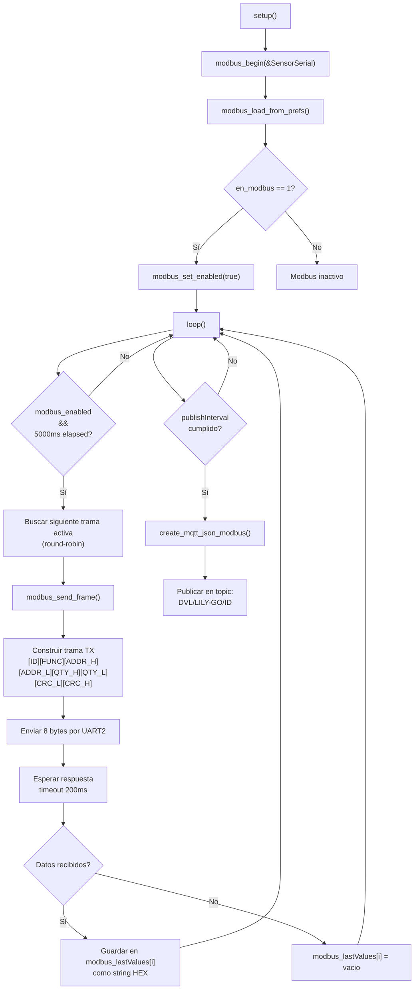
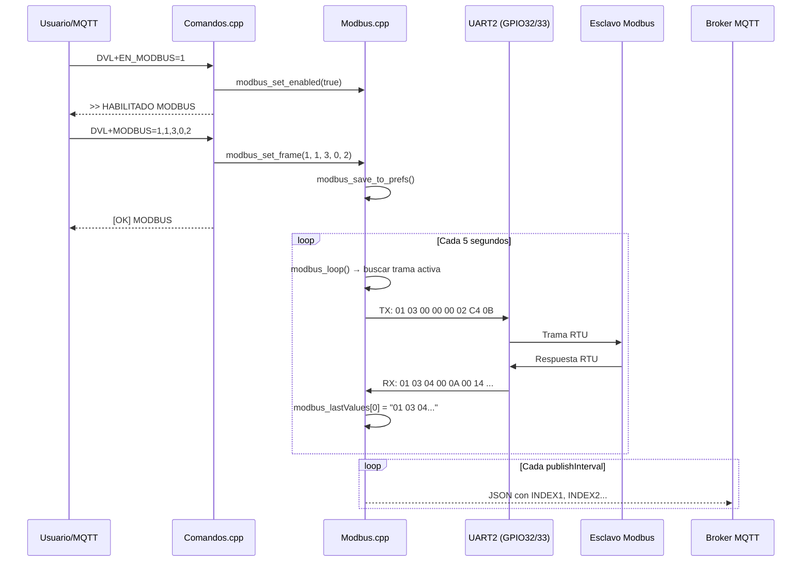

# Análisis de la Implementación Modbus RTU — LILY-GO

## Resumen General

El módulo Modbus implementa un **maestro Modbus RTU** sobre la UART2 de la ESP32. Permite configurar hasta **25 tramas de consulta** que se ejecutan secuencialmente en un esquema de **polling round-robin** cada 5 segundos. Las respuestas crudas (hex) se almacenan en memoria y se publican como JSON vía MQTT.

---

## Arquitectura de Archivos

| Archivo | Rol |
|:---|:---|
| [Modbus.h](file:///c:/Users/slerotich/Documents/GitHub/LILY-GO/main/Modbus.h) | Definición de API, estructura `ModbusFrameCfg`, constante `MODBUS_MAX_FRAMES` |
| [Modbus.cpp](file:///c:/Users/slerotich/Documents/GitHub/LILY-GO/main/Modbus.cpp) | Implementación completa: CRC, TX/RX, persistencia, polling |
| [Comandos.cpp](file:///c:/Users/slerotich/Documents/GitHub/LILY-GO/main/Comandos.cpp) | Procesamiento de comandos de configuración Modbus (por Serial y MQTT) |
| [MQTT.cpp](file:///c:/Users/slerotich/Documents/GitHub/LILY-GO/main/MQTT.cpp) | Función `create_mqtt_json_modbus()` para armar el JSON de salida |
| [main.ino](file:///c:/Users/slerotich/Documents/GitHub/LILY-GO/main/main.ino) | Integración: inicialización, loop de polling, envío periódico |

---

## Estructura de Datos

Cada trama configurable se representa con la estructura [ModbusFrameCfg](file:///c:/Users/slerotich/Documents/GitHub/LILY-GO/main/Modbus.h#L9-L15):

```cpp
typedef struct {
  uint8_t  id;    // Dirección del esclavo Modbus (1-247)
  uint8_t  func;  // Código de función (ej: 0x03 = Read Holding Registers)
  uint16_t addr;  // Dirección de inicio del registro 
  uint16_t qty;   // Cantidad de registros a leer
  bool     used;  // Flag: si esta entrada está activa o vacía
} ModbusFrameCfg;
```

Se mantiene un array estático de 25 posiciones:
```cpp
static ModbusFrameCfg frames[MODBUS_MAX_FRAMES];  // 25 tramas máximo
String modbus_lastValues[MODBUS_MAX_FRAMES];       // Últimas respuestas hex
```

---

## Flujo Completo



---

## Detalle de Cada Componente

### 1. CRC16 Modbus — [modbus_crc16()](file:///c:/Users/slerotich/Documents/GitHub/LILY-GO/main/Modbus.cpp#L20-L34)

Implementación estándar del CRC-16 Modbus (polinomio `0xA001`, valor inicial `0xFFFF`):
- Se calcula sobre los **6 bytes de payload** (ID + FUNC + ADDR_H + ADDR_L + QTY_H + QTY_L).
- El CRC se agrega al final en formato **little-endian** (byte bajo primero, byte alto después).

### 2. Transmisión y Recepción — [modbus_send_frame()](file:///c:/Users/slerotich/Documents/GitHub/LILY-GO/main/Modbus.cpp#L147-L201)

**Trama TX (8 bytes):**
```
[Slave_ID] [Function] [Addr_Hi] [Addr_Lo] [Qty_Hi] [Qty_Lo] [CRC_Lo] [CRC_Hi]
```

**Recepción:**
- Espera hasta **200ms** después del envío para leer la respuesta.
- Buffer de lectura: 64 bytes máximo.
- La respuesta se convierte a **string hexadecimal** (ej: `"01 03 04 00 0A 00 14 B8 44 "`) y se almacena en `modbus_lastValues[frameIndex]`.
- Si no hay respuesta, se guarda string vacío `""`.

> [!IMPORTANT]
> El timeout de lectura es de solo **200ms**. Algunos esclavos Modbus lentos (como medidores de energía o sensores industriales) pueden necesitar hasta 500-1000ms. Si se detectan respuestas vacías frecuentes, este valor debería aumentarse.

### 3. Polling Round-Robin — [modbus_loop()](file:///c:/Users/slerotich/Documents/GitHub/LILY-GO/main/Modbus.cpp#L203-L219)

- Ejecuta **una sola trama por ciclo** cada `pollIntervalMs = 5000ms` (5 segundos).
- Utiliza un índice rotativo `pollIndex` que avanza circularmente por las 25 posiciones.
- **Solo envía tramas marcadas como `used`**, saltando las entradas vacías.
- Cada ciclo busca la siguiente trama activa a partir de `pollIndex`.

> [!NOTE]
> Esto significa que si tenés 5 tramas configuradas, cada una se consulta cada 25 segundos (5 tramas × 5s cada una). El intervalo **real** por trama es `5s × cantidad_de_tramas_activas`.

### 4. Persistencia en Flash — [modbus_save_to_prefs()](file:///c:/Users/slerotich/Documents/GitHub/LILY-GO/main/Modbus.cpp#L93-L111) / [modbus_load_from_prefs()](file:///c:/Users/slerotich/Documents/GitHub/LILY-GO/main/Modbus.cpp#L113-L132)

Cada trama se serializa como un **blob de 7 bytes** en el namespace `"modbus"` de Preferences:

```
Byte 0: Slave ID
Byte 1: Function Code
Byte 2: Address High
Byte 3: Address Low
Byte 4: Quantity High
Byte 5: Quantity Low
Byte 6: Used flag (0 o 1)
```

Claves: `f1`, `f2`, ... `f25`. Además se persiste el flag `enabled`.

---

## Comandos de Configuración

Todos los comandos se procesan en [Comandos.cpp](file:///c:/Users/slerotich/Documents/GitHub/LILY-GO/main/Comandos.cpp) y pueden enviarse tanto por **puerto Serial** como por **MQTT** (topic `DVL/LILY-GO/<ID>/COMANDOS`).

### Comandos de Habilitación

| Comando | Acción | Detalle |
|:---|:---|:---|
| `DVL+EN_MODBUS=1` | **Habilita** Modbus | Deshabilita automáticamente `EN_SERIAL` (exclusión mutua, ya que ambos comparten UART2) |
| `DVL+EN_MODBUS=0` | **Deshabilita** Modbus | — |

> [!WARNING]
> **Exclusión mutua:** Modbus y Serial Secundario comparten el mismo puerto físico (UART2, GPIO32/33). Habilitar uno deshabilita automáticamente al otro. Esto se gestiona en [Comandos.cpp L199-L216](file:///c:/Users/slerotich/Documents/GitHub/LILY-GO/main/Comandos.cpp#L199-L216).

### Comandos de Configuración de Tramas

| Comando | Formato | Descripción |
|:---|:---|:---|
| `DVL+MODBUS=` | `idx,ID,FUNC,ADDR,QTY` | Configura una trama en el slot `idx` (1-5*). Valores en decimal o hex (`0x`). |
| `DVL+MODBUSCLR=` | `idx` o `ALL` | Borra la trama del slot `idx`, o **todas** con `ALL`. |

**Ejemplo práctico:**
```
DVL+MODBUS=1,1,3,0,2
```
Esto configura el slot #1 para consultar al **esclavo 1**, función **0x03** (Read Holding Registers), dirección de inicio **0x0000**, cantidad **2 registros**.

La trama Modbus RTU que saldrá por UART2 será:
```
01 03 00 00 00 02 C4 0B
└┬┘ └┬┘ └──┬──┘ └──┬──┘ └──┬──┘
 ID  FC   Addr     Qty     CRC
```

> [!NOTE]
> Aunque el array soporta 25 tramas (`MODBUS_MAX_FRAMES = 25`), el comando `DVL+MODBUS=` limita `idx` a **1-5** en la validación de [Comandos.cpp L283](file:///c:/Users/slerotich/Documents/GitHub/LILY-GO/main/Comandos.cpp#L283). Si se necesitan más, habría que ampliar este rango.

### Comandos de Consulta

| Comando | Respuesta |
|:---|:---|
| `DVL+QEN_MODBUS` | `EN_MODBUS=0` o `EN_MODBUS=1` |
| `DVL+QMODBUS` | Imprime por Serial el detalle de las 25 tramas configuradas |

---

## Publicación MQTT

Cuando llega el intervalo de publicación (`publishInterval`) y `en_modbus == 1`, el `main.ino` llama a [create_mqtt_json_modbus()](file:///c:/Users/slerotich/Documents/GitHub/LILY-GO/main/MQTT.cpp#L173-L198).

**El JSON resultante tiene esta estructura:**
```json
{
  "ident": "60363",
  "INDEX1": "01 03 04 00 0A 00 14 B8 44 ",
  "INDEX2": "01 03 02 00 64 B8 44 ",
  "date": "2026-04-06 11:00:00",
  "latitud": "-34.603700",
  "longitud": "-58.381600",
  "Tension_bateria": 4.15,
  "Tension_principal": 12.3,
  "Version": "V02.03.03",
  "index": 42
}
```

- Los campos `INDEX1`, `INDEX2`, etc., corresponden a cada trama configurada que tuvo respuesta (string hex crudo de la respuesta del esclavo).
- Solo se incluyen los índices que tienen datos (`modbus_lastValues[i].length() > 0`).

**Topic de publicación:** `DVL/LILY-GO/<ident>`

---

## Integración en main.ino

### Inicialización (setup)
```cpp
modbus_begin(&SensorSerial);     // Asocia UART2 al módulo Modbus
modbus_load_from_prefs();        // Carga tramas guardadas en flash

if (en_modbus) {
    modbus_set_enabled(true);
    en_serial = 0;               // Exclusión mutua con Serial
}
```

### Loop principal
```cpp
// Ciclo de polling Modbus (cada 5s, una trama por vez)
if (en_modbus && modbus_get_enabled()) {
    modbus_loop();
}

// Publicación periódica MQTT (cada publishInterval segundos)
if (en_modbus == 1) {
    String jsonmodbus = create_mqtt_json_modbus(...);
    if (mqtt.connected()) {
        publish_mqtt_json(topic1, jsonmodbus);
    } else {
        flash_save_packet(jsonmodbus.c_str());  // Guarda offline
    }
}
```

---

## Diagrama de Secuencia



---

## Resumen de Puntos Clave

| Aspecto | Valor/Detalle |
|:---|:---|
| **Puerto físico** | UART2 (RX=GPIO32, TX=GPIO33), 4800 baud |
| **Protocolo** | Modbus RTU (binario con CRC16) |
| **Max tramas** | 25 (constante), pero comandos limitan a 5 |
| **Polling** | Round-robin, 1 trama cada 5s |
| **Timeout RX** | 200ms |
| **Persistencia** | Flash (Preferences, namespace `"modbus"`) |
| **Exclusión mutua** | Con `EN_SERIAL` (comparten UART2) |
| **Buffer RX** | 64 bytes |
| **Formato respuesta** | String hexadecimal crudo |
